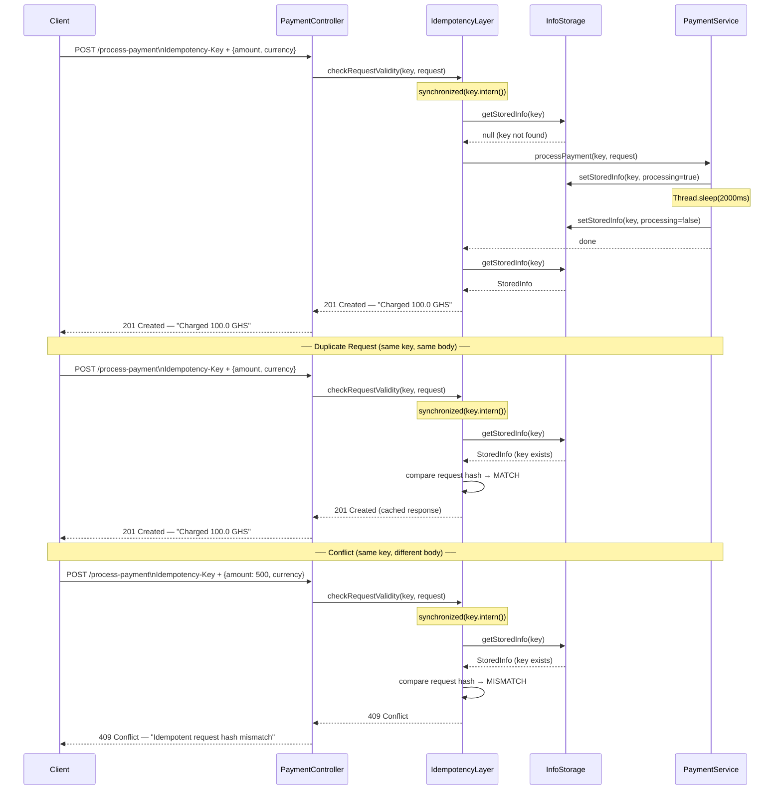

# Idempotency Gateway — The "Pay-Once" Protocol

A Spring Boot REST API that guarantees payment requests are processed **exactly once even under retries, network failures, or concurrent submissions**.

This project solves the **double-charging problem** that occurs when clients retry payment requests due to network timeouts or uncertain responses.

The system ensures that multiple requests with the same `Idempotency-Key` will always return the **same result** without executing the payment operation more than once.

---

# Architecture Diagram



---

# Project Structure

```
src/main/java/com/bbquantum/idempotencygateway/

├── Controller/
│   └── PaymentController.java
│        REST endpoint that receives payment requests

├── Service/
│   ├── IdempotencyLayer.java
│   │     Core idempotency logic and request validation
│   │
│   └── PaymentService.java
│         Simulates the payment processing logic

├── Storage/
│   └── InfoStorage.java
│        In-memory storage using ConcurrentHashMap

├── DTOs/
│   ├── PaymentRequest.java
│   │     Request body model
│   │
│   └── StoredInfo.java
│         Stored record containing request hash, response, and status

└── Utility/
    └── UtilityClass.java
         Request hashing and scheduled TTL cleanup
```

---

# Setup Instructions

## Prerequisites

* Java 21
* Maven 4.0.3

## Run the Server

```bash
# Clone the repository
git clone https://github.com/Benney-Walker/Idempotency-Gateway

cd idempotency-gateway

# Start the application
mvn spring-boot:run
```

The server starts at:

```
http://localhost:8080
```

No database or external services are required.
All state is stored **in memory**.

---

# API Documentation

## POST `/process-payment`

Processes a payment request protected by the idempotency layer.

### Required Header

| Header          | Type   | Description                         |
| --------------- | ------ | ----------------------------------- |
| Idempotency-Key | String | Unique key for each payment attempt |

Example keys:

```
order-001
txn-884733
UUID values
```

---

## Request Body

```json
{
  "amount": 100,
  "currency": "GHS"
}
```

---

# Scenario 1 — First Request (New Payment)

```bash
curl -X POST http://localhost:8080/process-payment \
  -H "Content-Type: application/json" \
  -H "Idempotency-Key: order-001" \
  -d '{"amount": 100, "currency": "GHS"}'
```

Response

```
201 Created
```

Body

```
Charged 100 GHS
```

This request triggers the **actual payment processing simulation**, which takes about **2 seconds**.

---

# Scenario 2 — Duplicate Request (Same Key + Same Body)

```bash
curl -X POST http://localhost:8080/process-payment \
  -H "Content-Type: application/json" \
  -H "Idempotency-Key: order-001" \
  -d '{"amount": 100, "currency": "GHS"}'
```

Response

```
201 Created
```

Header

```
X-Cache-Hit: true
```

Body

```
Charged 100 GHS
```

The system **returns the cached response instantly** without processing the payment again.

---

# Scenario 3 — Conflict (Same Key + Different Body)

```bash
curl -X POST http://localhost:8080/process-payment \
  -H "Content-Type: application/json" \
  -H "Idempotency-Key: order-001" \
  -d '{"amount": 500, "currency": "GHS"}'
```

Response

```
409 Conflict
```

Body

```
Idempotent request hash mismatch! Key already used
```

The server rejects the request because the same key cannot be reused for a different payment.

---

# Design Decisions

## 1. synchronized(key.intern()) for Race Condition Handling

Concurrency is handled using Java's `synchronized` block with `key.intern()`.

Interning ensures that identical string values reference the **same object in the JVM string pool**, allowing threads using the same idempotency key to synchronize on the exact same lock.

This guarantees that if two requests with the same key arrive simultaneously:

1. One thread processes the payment.
2. The second thread waits for the first to finish.
3. The second thread then returns the cached result.

This prevents duplicate processing.

---

## 2. isProcessing Flag for In-Flight Requests

`StoredInfo` contains a `processing` flag.

When a request begins processing:

```
processing = true
```

After payment simulation finishes:

```
processing = false
```

If another thread finds `processing == true`, it waits briefly before retrieving the completed result.

This ensures safe handling of **concurrent duplicate requests**.

---

## 3. Request Fingerprinting

Each payment request is fingerprinted by generating a deterministic string based on:

```
amount + currency
```

This fingerprint is stored in `StoredInfo`.

If the same key is reused with a different request body, the fingerprint comparison fails and the server returns:

```
409 Conflict
```

This prevents misuse of idempotency keys.

---

## 4. ConcurrentHashMap Storage

`InfoStorage` uses a `ConcurrentHashMap`.

This provides:

* thread-safe read/write operations
* efficient concurrency
* non-blocking operations for different keys

Multiple clients with different idempotency keys can interact with the system simultaneously without blocking each other.

---

# Developer's Choice Feature — TTL-Based Key Expiry

## What Was Implemented

A background scheduled job automatically removes expired idempotency keys.

```java
@Scheduled(fixedRate = 1200000)
public void cleanExpiredKeys() {
    long now = System.currentTimeMillis();

    infoStorage.getStorageMap().entrySet().removeIf(entry ->
        now - entry.getValue().getCreatedAt() > EXPIRATION_TIME
    );
}
```

### Behavior

* Runs every **20 minutes**
* Deletes keys older than **1 hour**

---

## Why This Matters

Without expiration, the in-memory store would grow indefinitely.

This would eventually consume all JVM memory and crash the service.

Additionally, idempotency keys should only remain valid for a limited time window.
Most legitimate retries occur within **seconds or minutes** of the original request.

Key expiration ensures:

* efficient memory usage
* prevention of stale key reuse

---

# Production Considerations

This implementation uses **in-memory storage** for simplicity.

In real payment systems, idempotency layers are typically backed by distributed infrastructure.

Possible production improvements include:

* **Redis** for distributed idempotency storage
* **Database-backed idempotency tables**
* **Distributed locking mechanisms**
* **Cryptographic request hashing (SHA-256)**
* **Authentication and rate limiting**

These improvements allow the idempotency gateway to operate reliably across **multiple server instances in a distributed environment**.

---

# Summary

This project demonstrates:

* Implementation of an **idempotent REST API**
* Safe handling of **concurrent requests**
* **race condition prevention**
* **duplicate payment protection**
* **automatic key expiration**

The result is a lightweight gateway that ensures **payment requests are processed exactly once**, even when clients retry due to network failures.